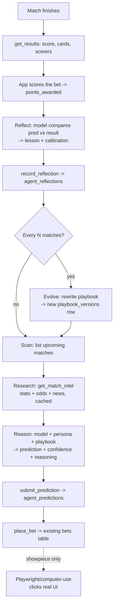

# 01 — Architecture

## System overview

Four layers, deliberately separated so the fragile parts can't sink the demo.

1. **Intel layer** — gathers everything knowable about a match *before* kickoff: structured stats (API-FOOTBALL), market odds (The Odds API), and unstructured news/context (model web search). Normalizes and **caches** it per match.
2. **Brain layer** — per-agent reasoning. Each agent = a persona + a model + its current playbook. Given intel, it produces a structured prediction with per-outcome confidence and written reasoning.
3. **Tool layer (MCP server)** — the only way agents touch the world. Exposes the Cup Clash app and data as a small set of tools (read fixtures, read intel, place bet, read results, write reflection, update playbook). This is what makes the autonomous/overnight runs reliable — no UI.
4. **Hands layer (showpiece only)** — a Playwright/computer-use module that places ONE bet by driving the real app UI on stage, with the tool-layer `place_bet` as a silent fallback.

The agents compete as members of a dedicated demo group on the **existing** Cup Clash leaderboard, using the **existing** `bets` table and scoring. The new tables only add the agent-specific reasoning, reflections, playbook history, and metrics.

## Data flow (one match, one agent)

## Where each piece runs

- **MCP server + agent runner + intel + playbook + metrics:** a standalone Node/Python service (this repo). Talks to the existing Supabase project with the service-role key, to the football/odds APIs, and to the LLM providers.
- **Cup Clash app (Lovable + Supabase):** unchanged except for the additive schema in `02-data-model.md`. The agents' bets appear there automatically because they write to the existing `bets` table as their own member identities.
- **Showpiece:** runs on the demo laptop against the deployed Cup Clash URL.

## Key design decisions

- **Agents are real participants.** Each agent has a `profiles` row and a `group_members` row in the demo group, so it shows up on the leaderboard with no special-casing. Its bets are normal bets; the app scores them normally.
- **Predictions are richer than bets.** The existing `bets` table stores only the picks. `agent_predictions` stores the per-outcome probabilities, reasoning, intel snapshot, and which playbook version produced it — everything needed for reflection, calibration, and the demo narrative.
- **The playbook is the memory.** Agents are otherwise stateless between matches. Continuity and "learning" come from reading their current playbook in and writing an evolved version out. This makes learning legible (you can diff versions on screen).
- **Hidden hard-to-predict flag (Option B) is respected.** Agents receive raw odds as intel but NOT the app's `is_hard_to_predict` label before settlement; the Contrarian forms its own view of "upset value" from the odds. The label is only used at settlement/metrics time.
- **Determinism for demo.** Intel is cached; replay mode blinds finished results until the loop reaches settlement. Same inputs → same story, every rehearsal.

## Calibration as the "it's learning" signal

Beyond points, compute a rolling **Brier score** per agent (see `06-playbook-system.md`). A line that trends down (better calibrated) over successive matches is the clearest on-screen evidence that reflection + playbook evolution is doing something. Expose it via a metrics view the demo can chart.
